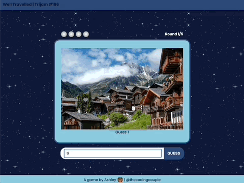

# trijam-186
Source code for Ashley's entry for Trijam #186. The theme is "I am a traveler."

[Trijam](https://itch.io/jam/trijam-186) is a weekly game jam where the goal is to create a game in under 3 hours of development time. Well Travelled was completed in about 8 hours of active development time.

## Synopsis

In Well Travelled, you've just returned from a trip around the world! As you review photos from the trip, can you correctly recall which countries you were in?

The objective of the game is to correctly identify which country is visible in the displayed photos. Try to guess all 5 countries correctly!



## Project Setup

Run with local web server

```bash
python -m http.server 8000
```

or

```bash
python3 -m http.server 8000
```

## Built With

* Vanilla JS
* Visual Studio Code

## Third Party Assets

* [Pixel Space Background Generator](https://deep-fold.itch.io/space-background-generator)
* [Pixel Planet Generator](https://deep-fold.itch.io/pixel-planet-generator) 
* All country images are from https://unsplash.com/. View countries.json for specific urls. 

## Useful Resources

* [Circle: Text Path Codepen](https://codepen.io/tylersticka/pen/ExxjyxO)

## Ideas for future improvements

* Build a text align circle path SVG generator

## Maintainers

* [Ashley Grenon - @townsean](https://github.com/townsean)

## License (MIT)

MIT License

Copyright (c) 2022 Ashley Grenon

Permission is hereby granted, free of charge, to any person obtaining a copy
of this software and associated documentation files (the "Software"), to deal
in the Software without restriction, including without limitation the rights
to use, copy, modify, merge, publish, distribute, sublicense, and/or sell
copies of the Software, and to permit persons to whom the Software is
furnished to do so, subject to the following conditions:

The above copyright notice and this permission notice shall be included in all
copies or substantial portions of the Software.

THE SOFTWARE IS PROVIDED "AS IS", WITHOUT WARRANTY OF ANY KIND, EXPRESS OR
IMPLIED, INCLUDING BUT NOT LIMITED TO THE WARRANTIES OF MERCHANTABILITY,
FITNESS FOR A PARTICULAR PURPOSE AND NONINFRINGEMENT. IN NO EVENT SHALL THE
AUTHORS OR COPYRIGHT HOLDERS BE LIABLE FOR ANY CLAIM, DAMAGES OR OTHER
LIABILITY, WHETHER IN AN ACTION OF CONTRACT, TORT OR OTHERWISE, ARISING FROM,
OUT OF OR IN CONNECTION WITH THE SOFTWARE OR THE USE OR OTHER DEALINGS IN THE
SOFTWARE.
